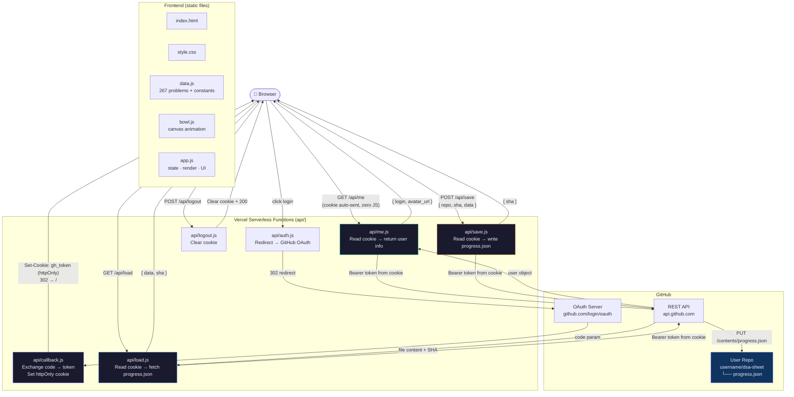

# DSA Sheet

> A personal, zero-dependency competitive programming tracker. Your progress lives in *your own* GitHub repo.
> Currently, I am using SDE Sheet of Jay Bansal.

---

## Why this exists

I wanted something that:

- Lives at a URL I control
- Stores progress in a format I can read and grep (plain JSON)
- Lets me write and save actual solution code, not just tick boxes
- Looks good enough that I actually open it

So I built this.

## Architecture

## Usage Guide

### Tracking progress
- Click the circle to cycle: `todo → solved → review → skip`
- Or pick from the dropdown
- Click the name to edit → Enter to save

### Writing solutions
- Click `</>` to open the editor
- Choose language → write → **Save**

### Reset
| Action | Status | Code | Resources | Notes |
|---|---|---|---|---|
| Reset section | todo | cleared | kept | kept |
| Reset topic | todo | cleared | kept | kept |
| Reset all | todo | cleared | kept | kept |
| Mark done | done | unchanged | kept | kept |

### Adding problems
- Use `+ add` → paste URL → add

### Filters & search
- Filter by status
- Use topic tabs
- Search works across everything

### Data
- Stored at `github.com/your-username/dsa-sheet/blob/main/progress.json`
- Version-controlled, portable

---

## Tech

- **Frontend**: Vanilla JS, CSS, Canvas API
- **Editor**: Monaco Editor 0.44 (VS Code's editor, via CDN)
- **Backend**: Vercel Serverless Functions (Node.js)
- **Auth**: GitHub OAuth 2.0
- **Storage**: GitHub Contents API (`PUT /repos/{owner}/{repo}/contents/{path}`)

---
